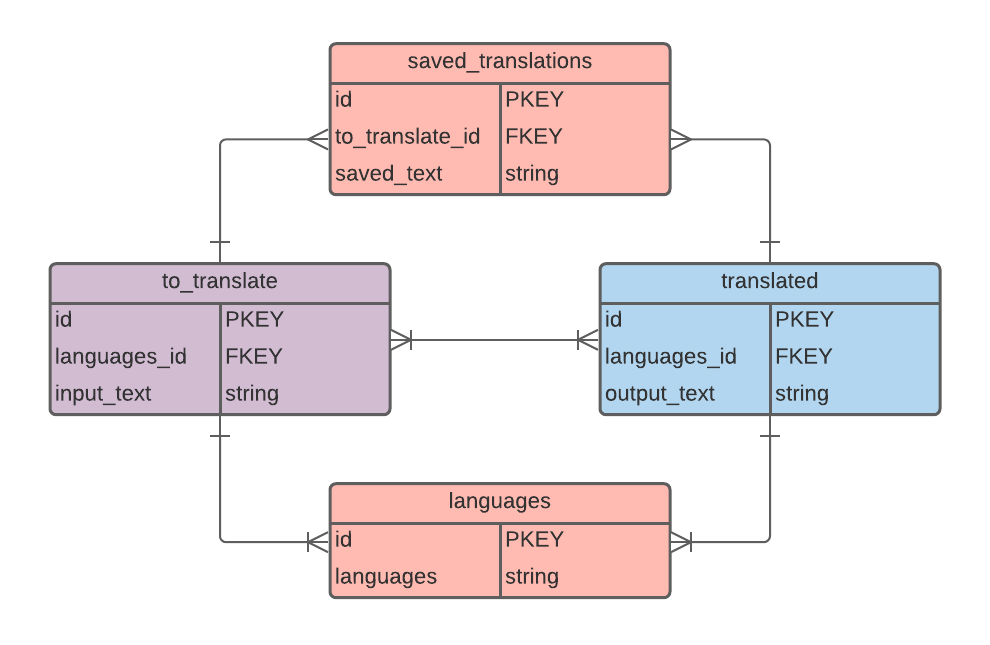
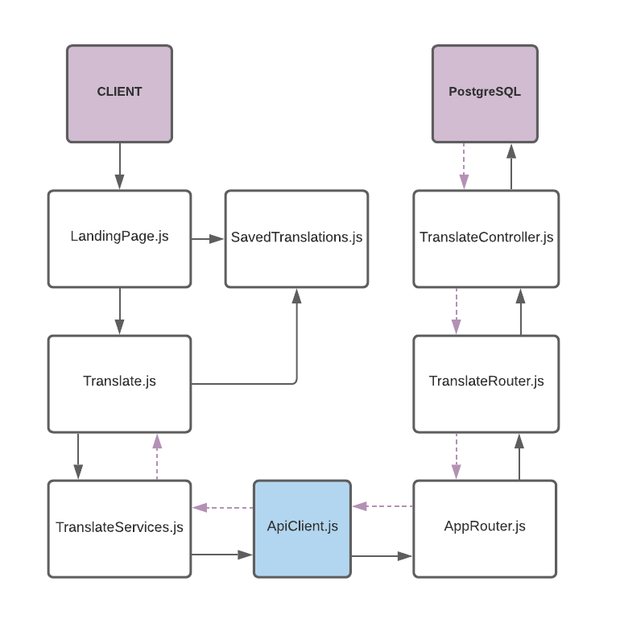

# mother-tongue

Jady Hom [Github](https://github.com/jadyhome) | [LinkedIn](www.linkedin.com/in/jadyhom)

---

### Description

mother-tongue is a translation full-stack website. Users can input text, choose their language of choice, and translate to the output of their language of choice.

---

### Technologies Used

- HTML / CSS / Javascript
- Postresql
- Express
- React
- react-md
- Node

---

### Getting Started

[Trello Board](https://trello.com/b/Jw1J1RK4/mother-tongue) - where I kept track of the process of creating this fullstack application.

---

### User Stories

- Users will see homepage/landing page.
- Users will be able to navigate to the translate page.
- Users will be able to choose language of their choice to translate from and input text.
- Users will be able to choose language of their choice to translate to and have output text.
- Users will be able to see history of translations.
---

### ERD - Entity Relationship Diagram

---

### Component Hierarchy Diagram

---

### Wireframe

Initial Mockup/Wireframe

---

### Screenshots

Final Mockup/Wireframe

---

### Future Updates

- [ ] 

---

### Credits

[LucidChart](https://www.lucidchart.com/)

[Trello Board](trello.com)

[react-md@v2](https://react-md.dev/)

[Heroku](https://www.heroku.com/)
