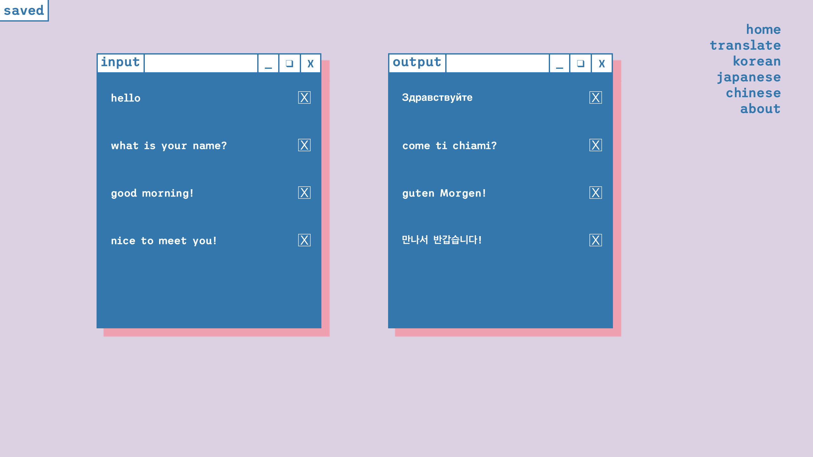

# mother-tongue

#### Jady Hom

[Github](https://github.com/jadyhome) | [LinkedIn](www.linkedin.com/in/jadyhom)

---

### Description

**_mother-tongue_** is a language translation full-stack website. Users can choose their language of choice and translate their text input.

---

### Technologies Used

- HTML / CSS / Javascript
- Postresql
- Express
- React
- Node

---

### Getting Started

Check out my deployed website here –– [mother-tongue](https://mother-tongue.herokuapp.com/)

[Trello Board](https://trello.com/b/Jw1J1RK4/mother-tongue) - where I kept track of the process of creating this fullstack application.

---

### User Stories

- Users will see homepage/landing page.
- Users will be able to navigate to the translate page.
- Users will be able to choose a language of their choice to _translate from_ and input text.
- Users will be able to see their translated output text.
- Users will be able to navigate to the saved page and see the history of translations.
- Users will be able to navigate to the pages with other languages - ie. Korean, Japanese, and Chinese.
- Users will be able to navigate to the about page.

---

### Wireframe

Initial Mockup/Wireframe

---

### Screenshots

Final Mockup/Wireframe

Home Page

Translate Page

Saved Page

Korean Language Page

Japanese Language Page

Chinese Language Page

About Page

---

### Future Updates

- [ ] Add a form for users to input their own translations
- [ ] Add a comment form in the about page for users to leave feedback

---

### Credits

[LucidChart](https://www.lucidchart.com/)

[Trello Board](trello.com)

[Google Cloud Translation API](https://cloud.google.com/translate/docs)

[Trispace Google Font](https://fonts.google.com/specimen/Trispace?category=Sans+Serif,Display,Handwriting&preview.text=mother-tongue&preview.text_type=custom&selection.family=Trispace#standard-styles)

[Favicon](https://www.favicon.cc/)

[Hello - Duolingo](https://forum.duolingo.com/comment/5940911/Hello-in-100-Languages)

[Heroku](https://www.heroku.com/)
